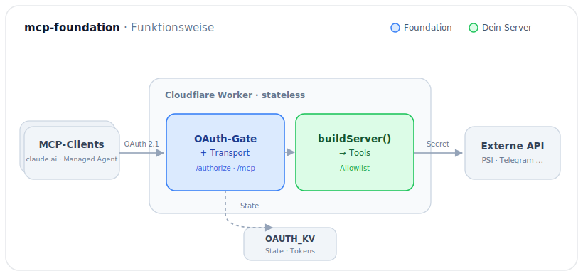

# mcp-foundation — Framework-Referenz

> Detail-Dokumentation der Foundation. Einstieg, Bereitstellung und Setup stehen im
> [README](../README.md); diese Datei sammelt die repo-spezifische Tiefe.

Server-agnostisches Framework für eigene MCP-Server auf **Cloudflare Workers**.
Wird als **versionierte Git-Dependency** konsumiert
(`github:wemwi/mcp-foundation#<neuester-tag>` — aktuellen Tag aus Badge / Releases
einsetzen, nicht abschreiben), nicht über npm publiziert. **Kein GitHub-Template.**

> **v2.0 — Inbound-Auth ist OAuth 2.1** (via `@cloudflare/workers-oauth-provider`,
> stateless über KV). `static_bearer` bleibt im Code, ist aber dormant (nur lokales
> Testing).

## Inhalt

- [Quickstart](#quickstart)
- [Funktionsweise](#funktionsweise)
- [API: `createOAuthWorker`](#api-createoauthworker)
- [Voraussetzungen](#voraussetzungen)
- [Struktur](#struktur)
- [Architektur-Regeln](#architektur-regeln)
- [Bundling-Fallen: SDK-Dedup & `ai`-Alias](#bundling-fallen-sdk-dedup--ai-alias)
- [Neuen Server aufsetzen](#neuen-server-aufsetzen)
- [OAuth-Flow (Connect)](#oauth-flow-connect)
- [Eject (Kunden-Übergabe)](#eject-kunden-übergabe)
- [OAuth-Stolperfallen-Checkliste](#oauth-stolperfallen-checkliste)
- [Verifizierte Tech-Fixpunkte](#verifizierte-tech-fixpunkte)

## Quickstart

Ein Server besteht aus genau zwei Dateien, die du selbst schreibst: `src/index.ts`
(Wiring) und `src/server.ts` (Tools). Das Minimal-Wiring:

```ts
// src/index.ts
import { createOAuthWorker } from "mcp-foundation/hosting";
import { buildServer } from "./server.js";

export default createOAuthWorker({
  buildServer,                              // Pflicht: Tools (src/server.ts)
  login: { userId: "me", title: "X MCP" }, // /authorize-Login-Seite
  route: "/mcp",                            // Streamable HTTP — nie /sse
});
```

```ts
// src/server.ts
import { McpServer } from "@modelcontextprotocol/sdk/server/mcp.js";
import { z } from "zod";
import type { BuildServer } from "mcp-foundation/core";
import { createAllowlistedRegistrar } from "mcp-foundation/tooling";

const TOOL_ALLOWLIST = ["ping"] as const;

export const buildServer: BuildServer = ({ env, auth }) => {
  const server = new McpServer({ name: "x-mcp", version: "1.0.0" });
  const register = createAllowlistedRegistrar(server, TOOL_ALLOWLIST);
  // name = <verb>_<objekt>, snake_case, kein Prefix (Regex ^[a-zA-Z0-9_-]{1,64}$).
  // title = Anzeigename (Title Case, Leerzeichen erlaubt) — nie in der Allowlist.
  register("ping", { title: "Ping", inputSchema: {} }, async () => ({
    content: [{ type: "text" as const, text: "pong" }],
  }));
  return server;
};
```

Vollständige Schritte (KV, Secrets, Deploy) → [Neuen Server aufsetzen](#neuen-server-aufsetzen).
Alle Optionen von `createOAuthWorker` → [API](#api-createoauthworker).

## Funktionsweise

Die Foundation übernimmt Auth + Transport; ein Consumer-Repo liefert nur `buildServer`
und die Tools. Beides läuft in **einem** stateless Cloudflare Worker.



**Blau** = von der Foundation geliefert (OAuth-Gate + Transport). **Grün** = vom
Consumer-Repo geliefert (`buildServer` + Tools). **Schloss** = Secret: zwei Welten —
`MCP_AUTH_PASSWORD_HASH` schützt den Login am Gate (**inbound**), das service-spezifische
Credential (`<AUSSTELLER>_<TYP>`) authentifiziert die Tools gegen die externe API
(**outbound**). Ablauf: Der Client authentifiziert sich per OAuth 2.1 (Login-Seite →
Passwort-Hash), der State liegt in `OAUTH_KV`, gültige Requests gehen an den MCP-Handler
unter `/mcp`. Pro Request entsteht eine frische `McpServer`-Instanz mit den in
`TOOL_ALLOWLIST` freigegebenen Tools.

## API: `createOAuthWorker`

`export default createOAuthWorker(options)` baut den gesamten Worker. Die Optionen:

| Option | Default | Hinweis |
|---|---|---|
| `buildServer` | — **(Pflicht)** | Factory; liefert pro Request eine FRISCHE `McpServer`-Instanz (CVE-Guard ab SDK 1.26). |
| `login` | `{}` | Konfig der `/authorize`-Login-Seite — siehe [`login`-Optionen](#login-optionen). |
| `allowedOrigins` | `[]` | DNS-Rebinding-Schutz. Leer = nur Clients **ohne** Origin-Header (S2S-Agents). Browser-Origins explizit whitelisten. |
| `route` | `/mcp` | ⚠️ **Nie `/sse`** — Streamable HTTP. Muss mit `apiRoute` übereinstimmen. |
| `logger` | — | Optionaler strukturierter Logger (`createLogger`). |
| `scopesSupported` | `["mcp"]` | In der Discovery angekündigte Scopes. |
| `accessTokenTTL` | `3600` | Access-Token-Lebensdauer in Sekunden. |
| `refreshTokenTTL` | `undefined` | ⚠️ **Nicht `0` setzen!** `undefined` = unendlich (headless Agents). `0` stellt GAR KEIN Refresh-Token aus → stündliches Re-Login. `n > 0` = Ablauf nach n Sekunden. |
| `authorizeEndpoint` | `/authorize` | Provider-Endpoint (Login-Seite). |
| `tokenEndpoint` | `/token` | Provider-Endpoint (vom Provider selbst implementiert). |
| `clientRegistrationEndpoint` | `/register` | Provider-Endpoint (DCR, vom Provider selbst implementiert). |

### `login`-Optionen

Konfiguration der `/authorize`-Login-Seite (`LoginUiOptions`, an `login` übergeben):

| Option | Default | Hinweis |
|---|---|---|
| `passwordHashEnvVar` | `"MCP_AUTH_PASSWORD_HASH"` | Env-Var mit dem SHA-256-**Hex** des Passworts. Nie das Klartext-Passwort ablegen. |
| `userId` | `"user"` | Auf dem Grant vermerkte Identität. |
| `props` | `{ user: userId }` | Landen als `ctx.props` beim Tool-Kontext (`getMcpAuthContext()`). |
| `defaultScope` | `["mcp"]` | Fallback-Scope, falls der Client keinen anfragt. |
| `title` / `heading` | — | Branding der Login-Seite (Tab-Titel / Überschrift). |
| `stateTtlSeconds` | `600` | TTL des zwischengelagerten Login-States in KV. |
| `logger` | — | Optionaler Logger (wird sonst von `createOAuthWorker` durchgereicht). |

> **Identitätsmodell:** Die Foundation nutzt das in der Cloudflare-Doku als „Option A"
> bezeichnete Muster — **der Worker ist selbst der Identity Provider** (eigene
> Passwort-Login-Seite), es wird KEIN Upstream-IdP (Google etc.) eingebunden. Im Worker
> liegt nur der SHA-256-Hash, nie das Klartext-Passwort.

## Voraussetzungen

**Einmalig (für alle Server):**

- **Cloudflare-Account** mit Workers (Free-Tier genügt) und **Workers Builds** (Git-Integration) für den Deploy aus dem Repo.
- **GitHub** — pro Server ein Repo; die Foundation wird als Git-Dependency gezogen (öffentliches Repo oder Build-Zugriff).
- **Login-Passwort** für die MCP-Server, hinterlegt als SHA-256-Hash (`MCP_AUTH_PASSWORD_HASH`). Ein Passwort darf für alle Server gelten.
- **Node.js ≥ 24** nur für lokale Entwicklung/Typecheck. Im reinen Git-Build-Workflow baut Cloudflare — dann lokal nicht nötig.

**Pro Server:**

- Ein **KV-Namespace** (Binding **`OAUTH_KV`** — Name im Provider hardcodiert).
- Das **service-spezifische Outbound-Secret**, je nach angebundener API — z. B. `GOOGLE_PSI_API_KEY` (PageSpeed Insights), `TELEGRAM_BOT_TOKEN`, `LEXWARE_API_KEY`. Wird als `wrangler secret` bzw. im Dashboard gesetzt, nie ins Git.
- Ein eigenes **GitHub-Repo** als Kopie von `server-template/`.

## Struktur

Ein npm-Paket mit Subpath-Exports (kein Workspace — installiert sauber als Git-Dep):

| Import | Inhalt |
|---|---|
| `mcp-foundation/core` | `BuildServer`-Typ, Auth-Contract + `createStaticBearerAuth` (dormant), `createOriginCheck` |
| `mcp-foundation/logging` | `createLogger` (strukturiertes JSON) + `redact` (Secret-Redaction) |
| `mcp-foundation/hosting` | `createOAuthWorker` (OAuth 2.1, Default — inkl. `scheduled`-Handler für die KV-Hygiene) + `createLoginUiHandler` + `purgeExpiredData`; `createWorkerHandler` (static_bearer, lokales Testing) |
| `mcp-foundation/tooling` | `createAllowlistedRegistrar`, Test-Harness (`callMcp`/`listTools`), Eject-Script |

`server-template/` ist die Kopiervorlage für einen neuen Server.

## Architektur-Regeln

- **Transport:** Streamable HTTP unter `/mcp` (niemals `/sse`).
- **Stateless als Default:** `createOAuthWorker` → `createMcpHandler` (aus `agents/mcp`), OAuth-State in KV,
  kein Durable Object. Session-State/Elicitation nötig? → `McpAgent` + Durable Object + SQLite-Migration, `jurisdiction: "eu"`.
- **Factory pro Request:** `buildServer()` liefert bei JEDEM Request eine frische `McpServer`-Instanz.
  Pflicht ab MCP SDK 1.26 (CVE — geteilte Instanzen leaken Cross-Client-Responses). Kein Singleton.
- **Inbound-Auth:** OAuth 2.1 über `@cloudflare/workers-oauth-provider`. Der Provider wrappt den Worker und
  verifiziert Tokens VOR dem apiHandler; er implementiert `/token`, `/register` und die `/.well-known`-Discovery
  selbst — die Foundation baut nur die `/authorize`-Login-Seite (Passwort gegen `MCP_AUTH_PASSWORD_HASH`).
  Nur S256-PKCE (`allowPlainPKCE: false`). `static_bearer` (`AuthMiddleware`) bleibt dormant für lokales Testing
  über `createWorkerHandler`.
- **KV-Hygiene:** `createOAuthWorker` liefert neben `fetch` einen `scheduled`-Handler, der
  `purgeExpiredData` aufruft (abgelaufene/verwaiste Grants + DCR-Clients). Nötig, weil
  `refreshTokenTTL: undefined` (Default) Grants nicht von selbst verfallen lässt. Der Server
  muss nur den Cron Trigger in `wrangler.jsonc` (`triggers.crons`) setzen — im
  `server-template` bereits auf täglich 03:00 UTC vorkonfiguriert.
- **Outbound-Secrets:** ausschließlich `wrangler secret`, nie im Git (`.dev.vars`/`.env` hart in `.gitignore`).
- **Tools:** Allowlist statt Denylist (`createAllowlistedRegistrar`).
- **Logging:** strukturiert + Redaction (greift bei Keys wie token/secret/authorization und maskiert `Bearer …`).

## Bundling-Fallen: SDK-Dedup & `ai`-Alias

Zwei Dinge, die JEDES Consumer-Repo braucht, sonst bricht Typecheck oder Deploy. Im
`server-template` sind beide bereits gesetzt — die bestehenden Server (Telegram, Lexware,
pagespeed) haben sie ebenfalls.

**1. SDK-Dedup per `overrides`.** `agents` pinnt das MCP-SDK exakt (Stand 0.2.35:
`1.23.0`). Ohne Gegenmaßnahme liegen zwei SDK-Kopien im Baum → Typkonflikt
(`McpServer` nominal inkompatibel) und potenzieller Runtime-Versions-Skew.

```jsonc
// package.json (npm) — bei pnpm analog unter "pnpm": { "overrides": { … } }
"overrides": { "@modelcontextprotocol/sdk": "$@modelcontextprotocol/sdk" }
```

Das zwingt den ganzen Baum (inkl. `agents`) auf die eine Version aus den eigenen
dependencies (1.29.0).

**2. `ai`-Alias.** `agents` macht intern ein dynamisches `import("ai")` (Vercel AI SDK).
`ai` ist dort nur ein optionaler Peer und wird nicht mitinstalliert — ohne Gegenmaßnahme
bricht das esbuild-Bundling beim Deploy mit **„Could not resolve 'ai'"** ab. Alias auf
einen leeren Stub:

```jsonc
// wrangler.jsonc
"alias": { "ai": "./src/empty-ai.js" }
```

```js
// src/empty-ai.js — Passthrough-Stub
export const jsonSchema = (schema) => schema;
export default {};
```

## Neuen Server aufsetzen

1. `server-template/` kopieren, in `package.json` `name` + die `mcp-foundation`-Git-URL/Tag anpassen.
2. `wrangler.jsonc`: `name` setzen, `compatibility_date` = heutiges Datum. `nodejs_compat` und
   der `ai`-Alias bleiben Pflicht (→ [Bundling-Fallen](#bundling-fallen-sdk-dedup--ai-alias)).
3. KV-Namespace im Dashboard anlegen (Storage & Databases → KV), ID in `wrangler.jsonc` unter dem
   Binding **`OAUTH_KV`** eintragen (Name ist im Provider hardcodiert — nicht umbenennen). Pro Repo ein Namespace.
4. Tools in `src/server.ts` definieren — jeder Name muss in `TOOL_ALLOWLIST` stehen.
5. Login-Passwort als **Hash** setzen: `wrangler secret put MCP_AUTH_PASSWORD_HASH`
   (Wert = `echo -n 'dein-passwort' | sha256sum`). Nie das Klartext-Passwort ablegen.
6. Lokal testen: `npm run dev`, dann `npm run inspect` (MCP Inspector gegen `http://localhost:8788/mcp`)
   — der Inspector durchläuft den OAuth-Flow (Login-Seite → Passwort → „Erlauben").
7. Deploy: `npm run deploy`.

## OAuth-Flow (Connect)

Stateless, alle Vorgänge in `OAUTH_KV`. Der Erst-Connect ist interaktiv, danach laufen Refreshes
ohne weitere Login-Seite (`refreshTokenTTL` **nicht setzen** → `undefined` = unendlich, für headless
Managed Agents; → [API](#api-createoauthworker)).

1. Client (z.B. claude.ai-Connector / MCP Inspector) ruft `/.well-known/...` ab → Provider liefert Metadata.
2. Client registriert sich dynamisch über `/register` (DCR) und startet den Auth-Code-Flow (S256-PKCE).
3. `/authorize` zeigt die Foundation-Login-Seite: Passwort eingeben → „Erlauben".
   Schutz: CSRF (Cookie == Form-Feld) + State-Token in KV (kurze TTL).
4. Provider tauscht Code gegen Access-/Refresh-Token (`/token`). Die in `completeAuthorization` gesetzten
   `props` (z.B. `{ user }`) erreichen Tools via `getMcpAuthContext()`.

Pro Mandant ein eigenes Repo/Worker + eigener `OAUTH_KV`-Namespace + eigenes Passwort.

## Eject (Kunden-Übergabe)

Macht ein `*-mcp`-Kundenrepo self-contained, danach keine Propagation mehr:

```bash
# im Kundenrepo (normaler User):
npx mcp-foundation-eject
```

Kopiert die Foundation nach `vendor/mcp-foundation/` und nennt die manuellen Restschritte
(tsconfig-`paths`-Alias, Dep entfernen, install, Typecheck). Danach Ownership übertragen.

## OAuth-Stolperfallen-Checkliste

Beim Umbau eines Consumer-Repos auf v2 prüfen:

- [ ] KV-Binding heißt **exakt** `OAUTH_KV` (im Provider hardcodiert).
- [ ] `route`/`apiRoute` zeigt auf den realen MCP-Pfad (`/mcp`, nicht `/sse`).
- [ ] Nur S256-PKCE (`allowPlainPKCE: false` — von `createOAuthWorker` gesetzt).
- [ ] Pro Request frische `McpServer`-Instanz (SDK-1.26-Guard — `buildServer`).
- [ ] `/authorize` prüft CSRF (Cookie == Form) und Passwort-Hash.
- [ ] `refreshTokenTTL` für headless Agents **nicht setzen** (`undefined` = unendlich). **Nicht** `0` — `0` stellt gar kein Refresh-Token aus → stündliches Re-Login.
- [ ] `MCP_INBOUND_TOKEN` aus allen Workern entfernt; stattdessen `MCP_AUTH_PASSWORD_HASH` setzen.
- [ ] `ai`-Alias auf `src/empty-ai.js` gesetzt (→ [Bundling-Fallen](#bundling-fallen-sdk-dedup--ai-alias)).
- [ ] `overrides` für `@modelcontextprotocol/sdk` gesetzt (→ [Bundling-Fallen](#bundling-fallen-sdk-dedup--ai-alias)).
- [ ] `createStaticBearerAuth` bleibt im Code, nur dormant (lokales Testing).
- [ ] Outbound-Secrets (`LEXWARE_API_KEY` etc.) unangetastet.
- [ ] Dep `@cloudflare/workers-oauth-provider` ≈ `0.7.x` ergänzt.

## Verifizierte Tech-Fixpunkte

Stand 19.06.2026:

- **MCP SDK** `1.29.0` (stable, single-package; v2-Split pre-alpha, Launch 28.07.2026).
- **agents** `0.2.x` (`createMcpHandler` aus `agents/mcp`; dynamisches `import('ai')` → `ai`-Alias Pflicht).
- **@cloudflare/workers-oauth-provider** `0.7.2` (KV-Binding `OAUTH_KV` hardcodiert, `env.OAUTH_PROVIDER` zur Laufzeit injiziert).
- **Zod** `3.25+` / `4`.
- **Node** 24 LTS Zielruntime.
